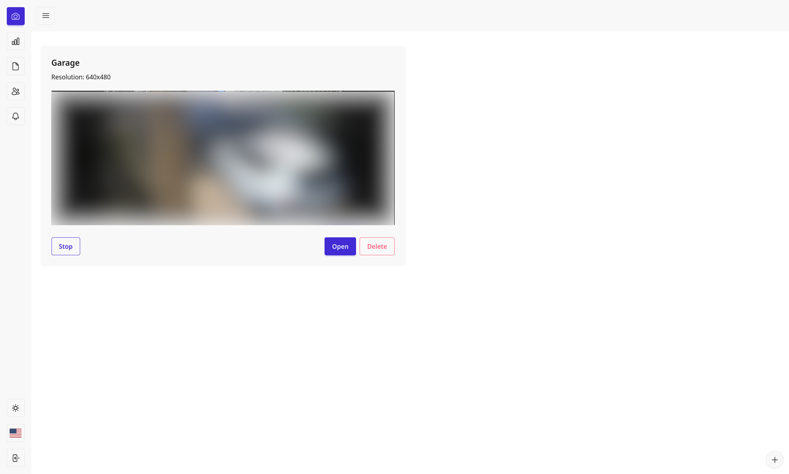
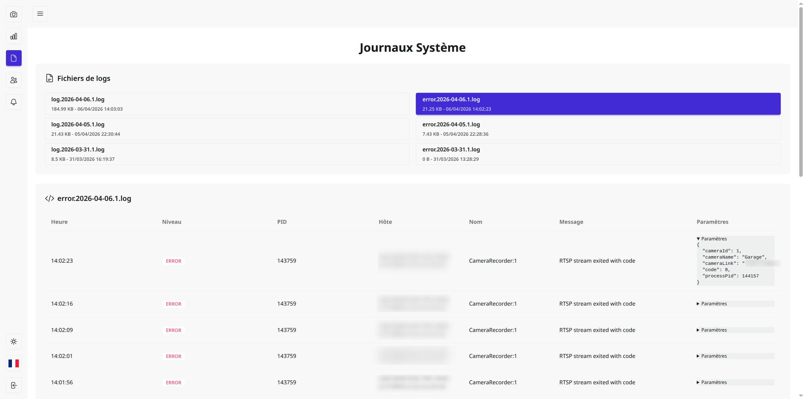
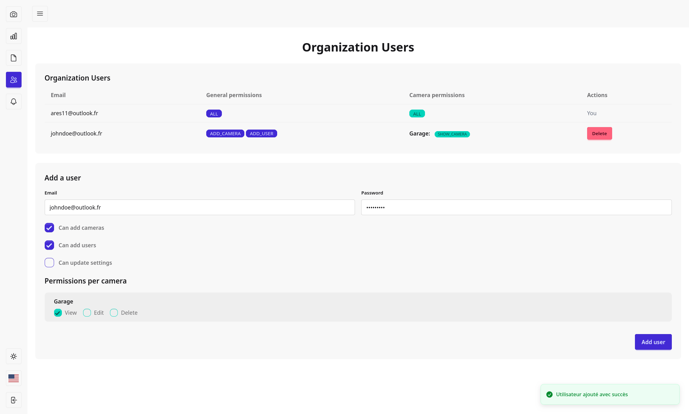
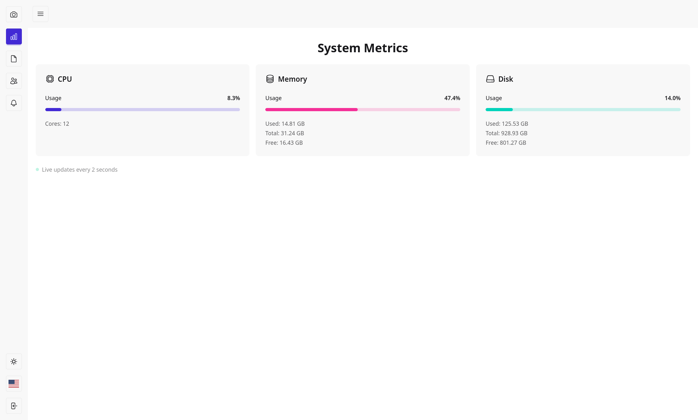

# Observatio

See your surveillance cameras in one place.

## Features

- Connect to your cameras with RTSP streaming protocol
- View live stream of your cameras
- Daily rotation video recording
- Watch the recordings and move the cursor in the video timeline with zero latency (HLS).
- Export the daily video in mp4 format
- User management and permissions
- Access ram/disk/cpu usage of the app
- Access the logs of the app (file and live)
- Alerting system for camera disconnection (telegram)
- Auto cleanup of old recordings when disk space is low

## Architecture

- A web app for UI for viewing the cameras, recordings, logs, and system status
- A job queue for processing hls to mp4 conversion and cleanup of old recordings
- A recorder that connects to the cameras and records the stream

3 applications based on the same codebase but which do not execute the same thing

## How to use

1. Clone the repository or copy `docker-compose.prod.yml`
2. Create a `.env` file based on the `.env.example` file and fill in the required environment variables ignore
   `APP_TYPE`, set `NODE_ENV` to `production` and set `HOST` to `0.0.0.0`
3. Run `docker compose -f ./docker-compose.prod.yml up -d` to start the application
4. Access the application at `http://localhost:3333`

## Tests

- `tests/browser/*` are UI tests using Playwright - nice for testing render + authority-wrapper
- `tests/functional/inertia/*` for tests permissions system with routes + HTTP request + inertia
- `tests/functional/api/*` for tests api routes + HTTP request
- `tests/units/*` for tests services + utils + etc... - no HTTP request, just unit tests
